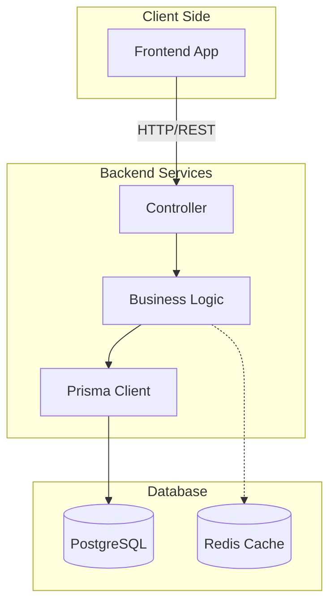
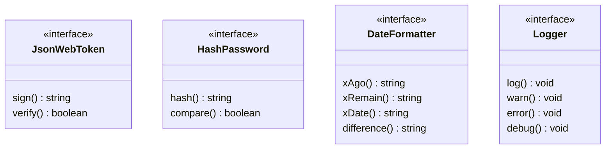
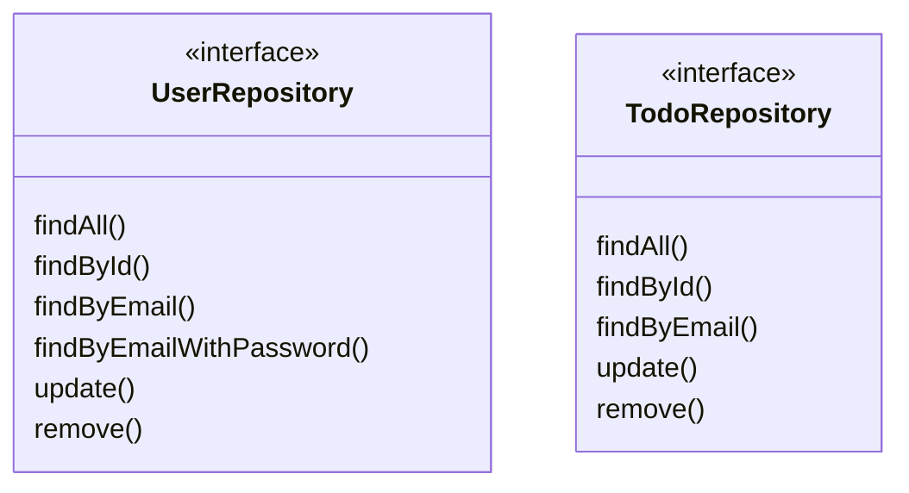
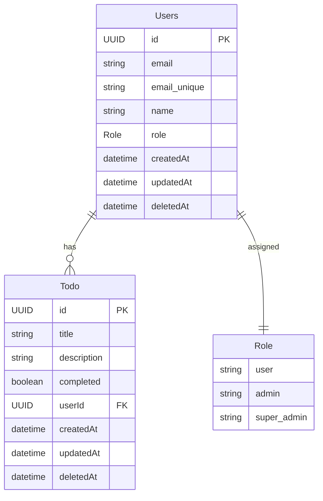
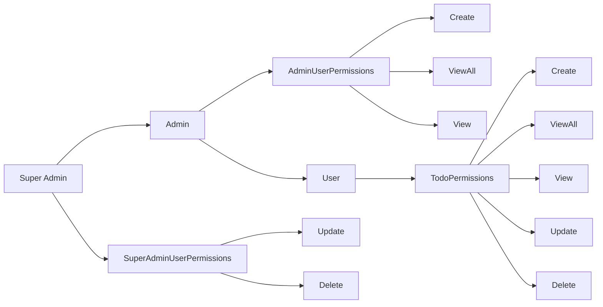

# Task Management Enterprise

A full-stack TypeScript monorepo application built with Turborepo, featuring a clean architecture pattern and domain-driven design.

## Project Overview

Task Enterprise is a robust task management system with user authentication, role-based access control, and a modern React frontend.

### Key Features

- User authentication and authorization
- Role-based access control with permission management
- Task management with CRUD operations
- Modern React frontend with shadcn-ui
- Clean architecture with domain-driven design
- Type-safe development with TypeScript

## User Requirements

[User Requirements](/docs/srs/Requirements.pdf)
[Requirement Analysis](/docs/srs/SRS_Analysis.pdf)

# Project Structure

## Architecture

The project is organized into multiple packages and apps, each with its own purpose.



## Apps

- `apps/restapi`: Express.js REST API backend service
- `apps/web`: React frontend application with shadcn-ui and Tailwind CSS

## Packages

- `packages/core`: Domain entities, interfaces, repositories, and use cases
- `packages/database`: Database implementations (Prisma)
- `packages/errors`: Custom error handling utilities
- `packages/eslint-config`: Shared ESLint configurations
- `packages/permission-manager`: Role and Attribute-based (RBAC & ABAC) access control system
- `packages/schemas`: Zod validation schemas
- `packages/shared`: Shared utilities
- `packages/typescript-config`: Shared TypeScript configurations

### `Shared Interfaces:`



### `Repositories:`



### `Use Cases:`

<!-- need to use a table -->

#### User UseCases:

| Use Case           | Description                                                              |
| :----------------- | :----------------------------------------------------------------------- |
| **Registration**   | Allows new users to sign up and create an account in the system.         |
| **Login**          | Validates user credentials and provides access via session or token.     |
| **AddUser**        | An administrative action to manually create and invite new users.        |
| **ViewUser**       | Retrieves a list of multiple users, usually for administrative purposes. |
| **ViewSingleUser** | Fetches the specific profile details and roles for a single user.        |
| **UpdateUser**     | Updates existing user information like name, email, or permissions.      |
| **DeleteUser**     | Removes a user account or marks it as inactive in the database.          |

#### Todo Use Cases

| Use Case       | Description                                                     |
| :------------- | :-------------------------------------------------------------- |
| **CreateTodo** | Creates a new task entry assigned to the authenticated user.    |
| **ViewTodos**  | Lists all tasks belonging to a user or a specific filtered set. |
| **UpdateTodo** | Modifies task details such as title, description, or status.    |
| **DeleteTodo** | Removes a specific task entry permanently from the list.        |

### `Entity Relationship Diagram`:



### `Permission Flow:`



## Getting Started

### Prerequisites

- Node.js >= 18
- pnpm 9.0.0
- PostgreSQL database

### Installation

1. Clone the repository:

```sh
git clone git@github.com:mislam-dev/task-management-enterprise.git
cd task-management-enterprise
```

2. Install dependencies:

```sh
pnpm install
```

3. Set up environment variables:

- Copy `.env.example` to `.env`
- Update the database connection string and other required variables

> N:B: There are several folder where .env.example is exist. You should update those

4. Set up the database:

```sh
pnpm -F @todo/database prisma:generate
pnpm -F @todo/database prisma:migrate
```

### Development

Start all services in development mode:

```sh
pnpm dev
```

Other useful commands:

```sh
# Build all packages
pnpm build

# Run linting
pnpm lint

# Format code
pnpm format

# Type checking
pnpm check-types
```

### Docker Support

This project support docker. Run following command to start:
`docker compose up`

## Architecture

The application follows a clean architecture pattern with:

- Domain Layer (`packages/core`)
- Infrastructure Layer (`packages/database`, `packages/shared`)
- Presentation Layer (`apps/restapi`, `apps/web`)

## About Me

Hi! I'm a passionate software engineer dedicated to creating enterprise-level solutions. With a focus on clean architecture and domain-driven design, I strive to build scalable and maintainable applications that solve real-world problems.

### My Expertise

- Full-stack Development with TypeScript
- Clean Architecture & DDD Principles
- Enterprise Application Design
- Modern Frontend Development (React)
- Backend Development (Node.js/Express)

## Contact Me

### Get in Touch

I'm always open to discussing technology, software architecture, or potential collaborations. Feel free to reach out through any of these channels:

- 📧 Email: mmislam027@gmail.com
- 💼 LinkedIn: [https://www.linkedin.com/in/mislam-dev/](https://www.linkedin.com/in/mislam-dev/)
- 🐱 GitHub: [https://github.com/mislam-dev](https://github.com/mislam-dev)
- 🌐 Portfolio: [https://mislam-dev.vercel.app/](https://mislam-dev.vercel.app/)

### Let's Connect

Whether you're interested in contributing to this project, have questions about the implementation, or just want to connect, I'd love to hear from you!
